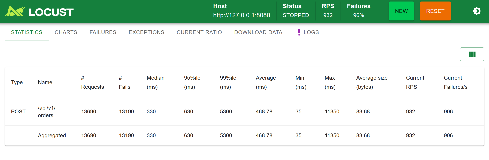
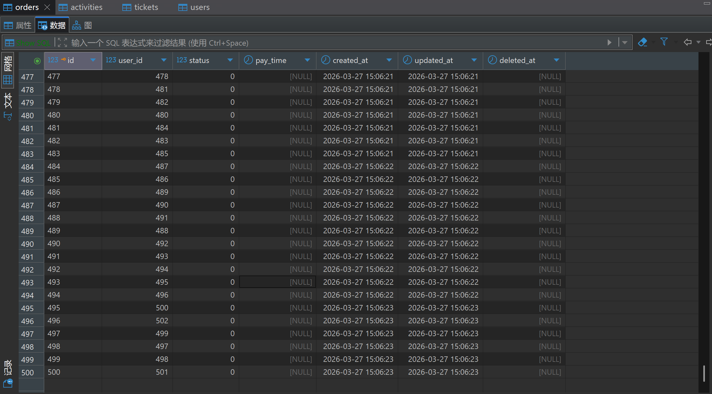
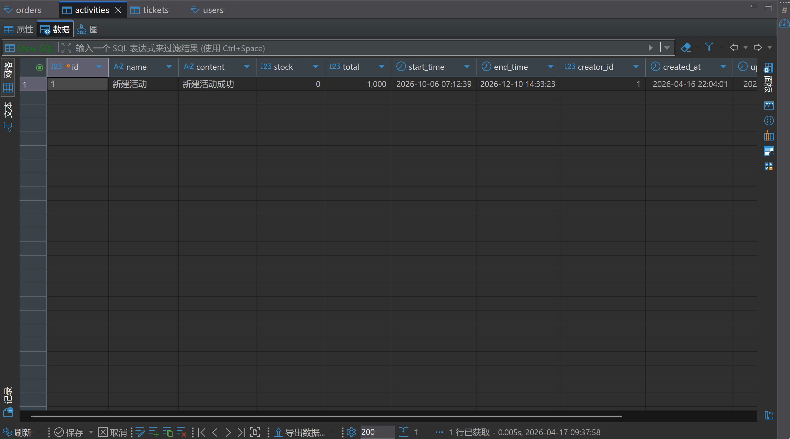
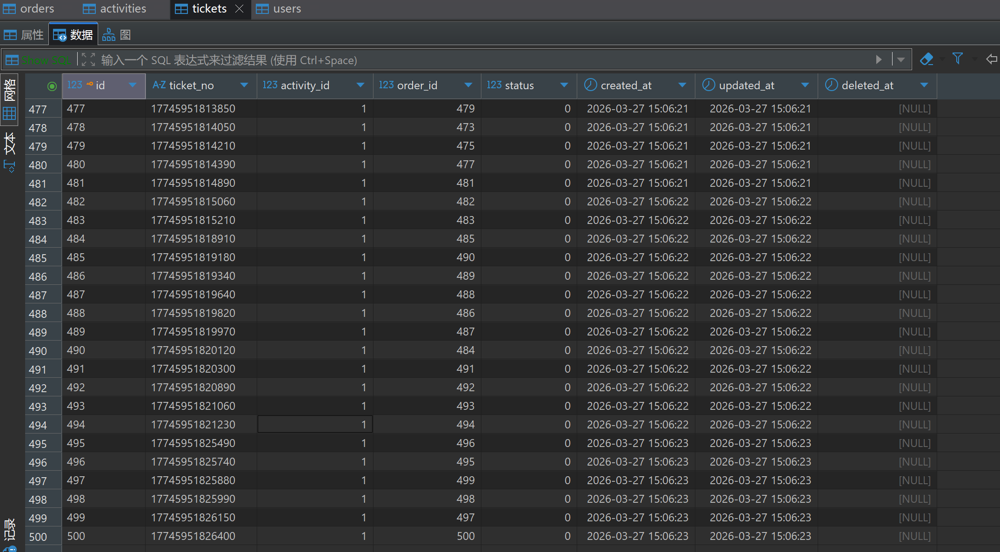

# G-Ticket 高性能校园活动抢票系统

基于 Go 语言开发的高并发抢票预约系统，旨在解决校园活动报名瞬时流量大、易超卖、数据库压力过载等痛点。

**技术栈**：Go 1.21+、Gin、GORM、MySQL、Redis (Lua Scripting)、Redis Stream、JWT

## 🚀 项目亮点

- ⚡ **高并发秒杀架构**：采用 **Redis Lua 脚本** 实现“查询-判断-扣减”原子化操作，从硬件层面杜绝超卖；结合 **Redis Stream** 消息队列实现异步落库，将下单接口耗时降至微秒级。
- 📊 **动态状态机设计**：摒弃传统的数据库状态字段冗余，通过活动时间轴 **动态计算活动状态**（未开始/进行中/已结束），确保业务数据逻辑的绝对一致性。
- 🧹 **异步资源清理机制**：下架活动时采用 **任务队列分批异步删除** 关联订单与门票，利用 Worker 协程平滑处理大数据量回滚，避免大事务锁表。
- 🔒 **全链路安全防护**：基于 **JWT** 的用户鉴权体系，并在 Lua 逻辑中嵌入 **Redis Set 去重策略**，精准拦截同一用户瞬间多次下单的恶意行为。

## 🏗️ 核心架构设计

项目采用标准的分层架构设计，确保逻辑清晰、易于扩展：
1. **Controller 层**：负责参数校验、响应封装及上下文管理。
2. **Logic 逻辑层**：承载核心业务，处理 Redis 与 MySQL 的双写一致性及异步任务投递。
3. **DAO/Model 层**：基于 GORM 封装数据库交互，利用软删除保护数据安全性。

## 🛠️ 技术细节

### 1. 核心秒杀逻辑 (Lua 原子性)
将库存校验与扣减逻辑封装在一条 Lua 脚本中发送给 Redis，利用 Redis 单线程执行特性，保证高并发环境下用户唯一性校验与库存扣减的原子性。

### 2. 异步削峰填谷 (Redis Stream)
下单成功后即刻返回，门票（Tickets）的生成由后台 **Stream Consumer** 异步完成。
- **可靠性**：利用消费组（Consumer Group）与 PENDING List 机制，确保消息在协程崩溃重启后仍能被正确确认（XACK）。
- **性能**：单机 RPS 承载能力相比同步写库提升了 5-10 倍。

### 3. 性能表现 (本地压测)

使用 **Locust** 模拟极端秒杀场景（500 并发用户，每秒 200 启动速率）

**Locust 测试结果**：


**数据库验证结果**：





| 指标 | 数值 | 结论 |
| :--- | :--- | :--- |
| **并发用户数** | 500 | 模拟真实抢票峰值流量 |
| **RPS (吞吐量)** | **650 ~ 930 req/s** | 逻辑处理性能优秀 |
| **P95 响应时间** | **< 630ms** | 核心链路延迟极低 |
| **数据一致性** | **100%** | Redis 库存与 MySQL 订单数完美对齐 |

## 📦 快速启动

1. **配置环境**：修改 `config/config.yaml` 中的 MySQL 与 Redis 连接信息。
2. **初始化队列**：程序启动时会自动执行 `XGroupCreateMkStream` 初始化消息队列。
3. **运行**：
   ```bash
   go run main.go
   ```
4. **压测验证**：
   ```bash
   # 先登录用户
   py prepare_users.py
   # 安装 Locust 后运行
   locust -f stress_test.py
   ```

---

## 项目框架
```
ticket_project
├── main.go             # 项目启动入口
├── config/             # 配置文件夹（存放数据库密码、Redis地址等）
│   └── config.yaml
│   └── config.go
│   └── order_loc.lua   # lua 脚本
├── controller/         # 接口层（处理接口请求）
│   ├── user_role.go    # 用户接口
│   ├── activity.go     # 活动接口
│   └── order.go        # 订单接口
│   └── ticket.go       # 票接口
├── logic/              # 业务层（抢票、并发、校验）
│   ├── user_logic.go
│   ├── activity_logic.go
│   ├── order_logic.go
│   └── ticket_logic.go
│   └── stream.go       # 消息队列 redis stream
├── models/             # 定义数据模型
│   ├── user.go         # 用户模型
│   └── role.go         # 角色模型
│   └── activity.go     # 活动模型
│   └── order.go        # 订单模型
│   └── ticket.go       # 票模型
├── dao/                # 数据库操作（GORM）
│   ├── init_mysql.go   # 初始化连接
│   └── init_redis.go   # 初始化 Redis 连接
├── router/             # 路由定义（定义 URL 到 Controller 的映射）
│   └── router.go
├── utils/              # 工具类
│   ├── midddle.go          # 中间件
│   └── response/
│       └── response.go     # 统一封装返回给前端的 JSON 格式
└── web/                # 前端（Vue3 项目）
    ├── 
    └── 
```
