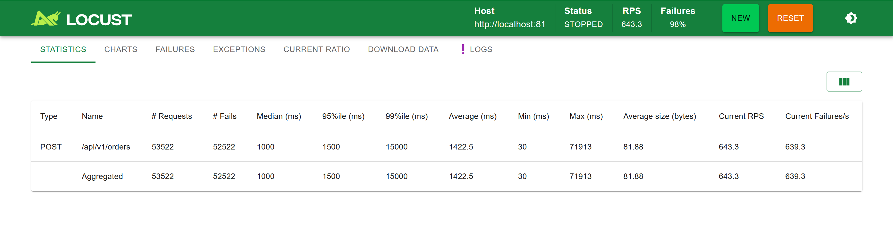
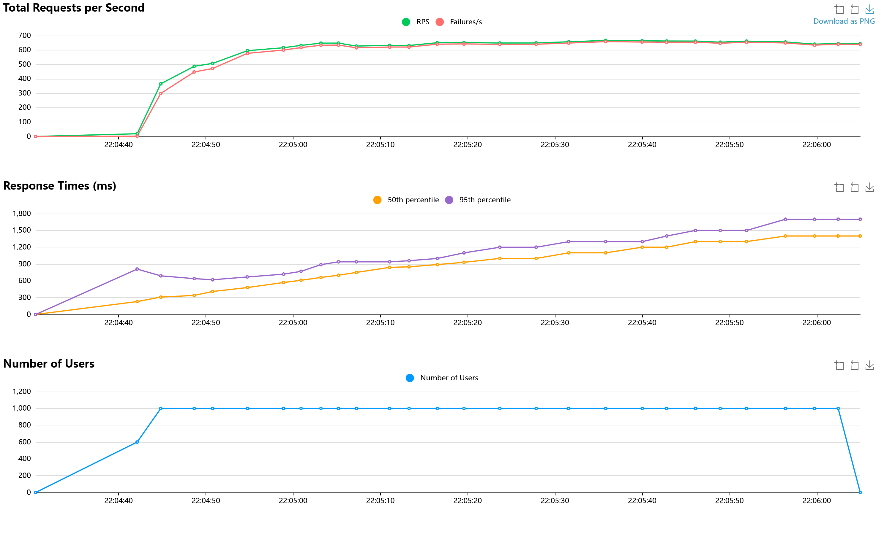
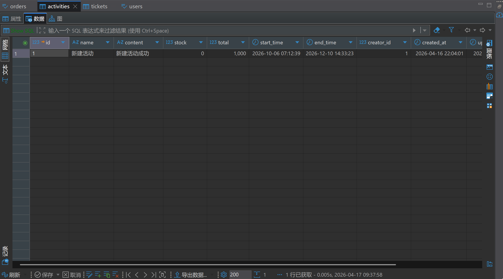
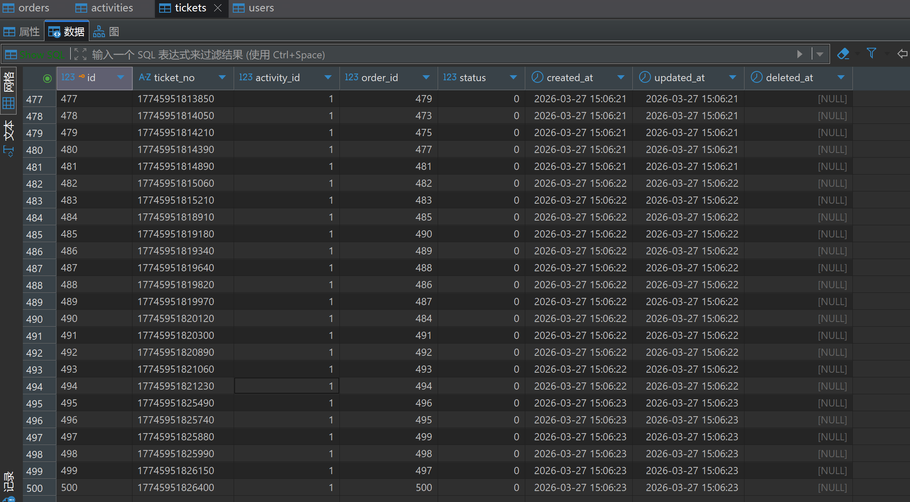

# G-Ticket 高性能校园活动抢票系统

基于 Go 语言开发的高并发抢票预约系统，旨在解决校园活动报名瞬时流量大、易超卖、数据库压力过载等痛点。

**技术栈**：Go 1.25+、Gin、GORM、MySQL、Redis (Lua Scripting)、Redis Stream、JWT、Nginx

## 🚀 项目亮点

- ⚡ **高并发秒杀架构**：采用 **Redis Lua 脚本** 实现“查询-判断-扣减”原子化操作，降低高并发下超卖风险；结合 **Redis Stream** 消息队列实现异步落库，缓解下单接口压力。
- 📊 **动态状态机设计**：摒弃传统的数据库状态字段冗余，通过活动时间轴 **动态计算活动状态**（未开始/进行中/已结束），确保业务数据逻辑一致。
- 🧹 **异步资源清理机制**：下架活动时采用 **任务队列分批异步删除** 关联订单与门票，利用 Worker 协程平滑处理大数据量回滚，避免大事务锁表。
- 🔒 **全链路安全防护**：基于 **JWT** 的用户鉴权体系，并在 Lua 逻辑中嵌入 **Redis Set 去重策略**，拦截同一用户瞬间多次下单行为。

## 🏗️ 架构设计

项目采用清晰的分层架构，核心链路围绕“同步抢票校验 + 异步出票落库”展开：

- **接口层（Controller / Router）**：负责路由注册、参数校验、鉴权上下文和统一响应。
- **业务层（Logic）**：承载活动、订单、门票等核心业务，处理 Redis Lua 扣减、Redis Stream 投递和消费逻辑。
- **数据层（DAO / Model）**：基于 GORM 管理 MySQL 数据访问，并封装 Redis 初始化、Lua 脚本加载和缓存操作。
- **部署层（Docker / Nginx）**：提供容器化运行环境和反向代理配置，支持前后端统一入口访问。

## 🛠️ 技术细节

### 1. 核心秒杀逻辑 (Lua 原子性)

将库存校验与扣减逻辑封装在一条 Lua 脚本中发送给 Redis，利用 Redis 单线程执行特性，保证高并发环境下用户唯一性校验与库存扣减的原子性。

### 2. 异步削峰填谷 (Redis Stream)

下单成功后即刻返回，门票（Tickets）的生成由后台 **Stream Consumer** 异步完成。

- **可靠性**：利用消费组（Consumer Group）与 Pending List 机制，确保消息在协程崩溃重启后仍能被继续处理并正确确认（XACK）。
- **性能**：在本地 Locust 压测条件下，异步处理方案将出票落库从抢票接口中拆出，使接口响应主要覆盖校验、扣库存、创建订单和消息投递链路。

### 3. 性能表现 (单机本地压测)

使用 **Locust** 在单机本地环境模拟抢票高峰场景（1000 并发用户，每秒 200 启动速率）。测试结果用于验证方案有效性，不等同于生产环境承载能力。

**Locust 测试结果**：




**数据库验证结果**：




| 指标 | 数值 | 结论 |
| :--- | :--- | :--- |
| **并发用户数** | 1000 | 本地模拟抢票高峰流量 |
| **RPS (吞吐量)** | **640 ~ 750 req/s** | 单机环境下抢票接口的每秒处理请求数 |
| **P95 响应时间** | **~1500ms** | 95% 的抢票接口请求在约 1.5s 内返回 |
| **数据一致性** | **未出现超卖** | Redis Lua 扣减与 Redis Set 去重保证核心抢票链路一致性 |

> 说明：上述 P95 为抢票接口响应时间，统计到订单创建与 Redis Stream 消息投递完成；门票生成由后台消费者异步执行，不计入该接口响应时间。

## 📦 本地启动

1. **准备依赖服务**：启动 MySQL 与 Redis。
2. **修改配置**：根据本地环境修改 `config/configs/config.yaml` 中的 MySQL 与 Redis 连接信息。
3. **启动后端服务**：
   ```bash
   go run main.go
   ```
4. **访问服务**：后端默认运行在 `http://localhost:8080`。

程序启动时会自动执行 `XGroupCreateMkStream` 初始化 Redis Stream 消费组，并启动后台消费者协程。

## 🐳 Docker 部署启动

1. **修改容器环境配置**：将 `config/configs/config.yaml` 中的服务地址调整为 docker-compose 内部服务名。
   ```yaml
   # mysql:host
   host: mysql

   # redis:addr
   addr: "redis:6379"
   ```

2. **拉取基础镜像**：
   ```bash
   docker pull mysql:8.0
   docker pull redis:latest
   docker pull nginx:latest
   docker pull golang:1.22-alpine
   docker pull alpine:3.20
   ```

3. **构建项目镜像**：
   ```bash
   docker build -t ticket_project:latest .
   ```

4. **启动完整服务**：
   ```bash
   docker compose up
   ```

5. **访问地址**：
   - Nginx 代理入口：http://localhost:81
   - 后端直接访问：http://localhost:8080

## 🧪 压测验证

1. **准备测试用户 Token**：
   ```bash
   py prepare_users.py
   ```

2. **启动 Locust**：
   ```bash
   locust -f stress_test.py
   ```

3. **在 Locust Web 页面配置并发参数后开始压测**，压测结果可参考上方截图。

## 📁 项目结构

```text
ticket_project
├── main.go                 # 项目启动入口
├── config/                 # 配置文件与 Redis Lua 脚本
├── controller/             # API 接口层
├── logic/                  # 核心业务逻辑：抢票、订单、出票、消息队列
├── dao/                    # MySQL / Redis 初始化与访问封装
├── models/                 # 数据模型
├── router/                 # 路由定义
├── utils/                  # 中间件与响应封装
├── web/                    # 前端项目
├── nginx/                  # Nginx 配置
├── Dockerfile
└── docker-compose.yaml
```
